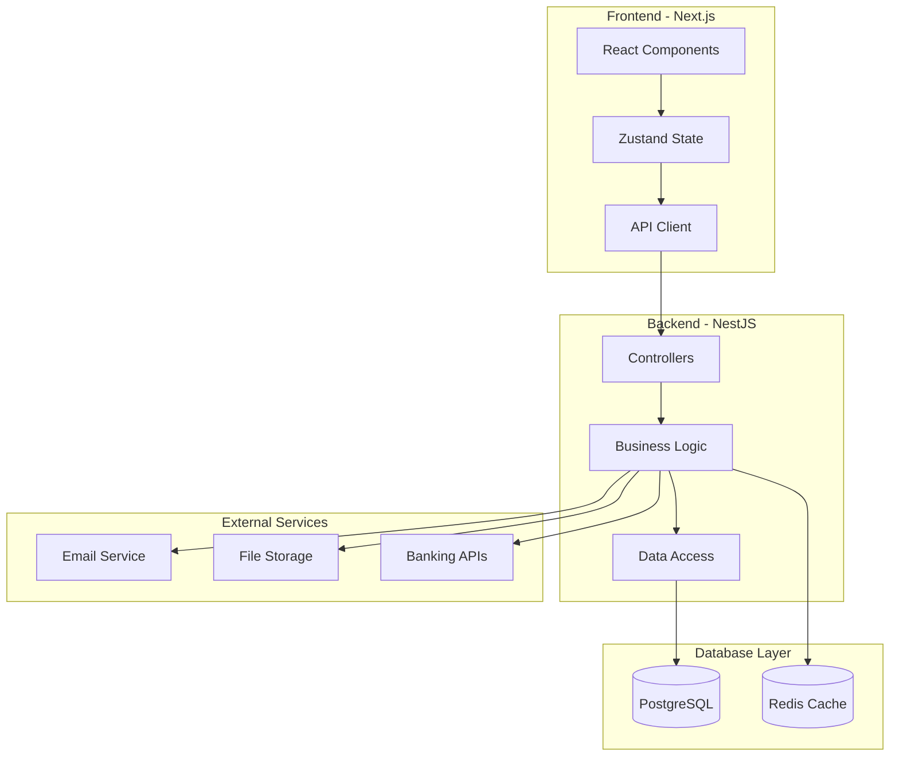
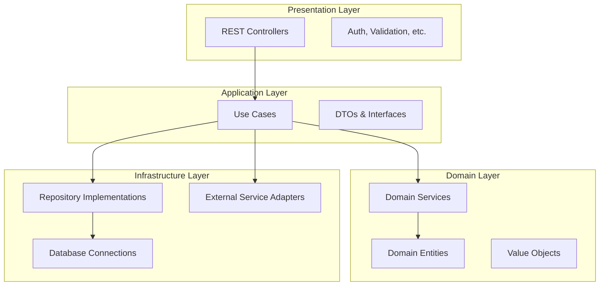
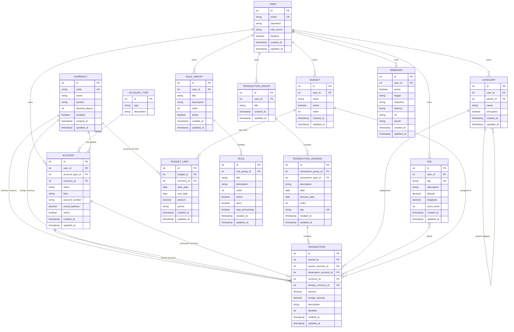

# Análisis Arquitectónico Completo - Firefly III Clone

## Resumen Ejecutivo

Este documento presenta un análisis exhaustivo de Firefly III para definir el scope completo de un proyecto de clonación usando NestJS (backend) y Next.js (frontend). Firefly III es un sistema de gestión financiera personal altamente sofisticado que incluye gestión de cuentas, transacciones complejas, automatización mediante reglas, presupuestos, reportes avanzados y una API REST completa.

## Tabla de Contenidos

1. [Funcionalidades Principales](#funcionalidades-principales)
2. [Entidades de Datos](#entidades-de-datos)
3. [Casos de Uso](#casos-de-uso)
4. [Arquitectura del Sistema](#arquitectura-del-sistema)
5. [Estructura de Módulos](#estructura-de-módulos)
6. [Estructura de Base de Datos](#estructura-de-base-de-datos)
7. [API Endpoints](#api-endpoints)
8. [Requisitos Técnicos](#requisitos-técnicos)
9. [Fases de Desarrollo](#fases-de-desarrollo)

## Funcionalidades Principales

### 1. Sistema de Autenticación y Usuarios

**Descripción:** Sistema completo de autenticación multi-factor con soporte para múltiples métodos de login.

**Características:**
- Autenticación local con email/password
- Two-Factor Authentication (2FA) con TOTP
- OAuth2 con Personal Access Tokens
- Autenticación por headers (para reverse proxy)
- Gestión de sesiones y logout automático
- Roles y permisos (admin, user)

**Entidades involucradas:**
- [`User`](src/entities/user.entity.ts): Usuario principal
- [`UserPreference`](src/entities/user-preference.entity.ts): Preferencias del usuario
- [`AccessToken`](src/entities/access-token.entity.ts): Tokens de acceso API

### 2. Gestión de Cuentas

**Descripción:** Sistema completo para gestionar diferentes tipos de cuentas financieras.

**Tipos de cuentas:**
- **Asset accounts:** Cuentas corrientes, ahorros, efectivo
- **Expense accounts:** Categorías de gastos (supermercado, gasolina, etc.)
- **Revenue accounts:** Fuentes de ingresos (salario, freelance, etc.)
- **Liability accounts:** Deudas, tarjetas de crédito, préstamos
- **Initial balance:** Balances iniciales para configuración

**Características:**
- IBAN/número de cuenta
- Moneda nativa por cuenta
- Balance actual calculado automáticamente
- Histórico de balances
- Cuentas activas/inactivas
- Virtual balance para proyecciones

**Entidades involucradas:**
- [`Account`](src/entities/account.entity.ts): Cuenta principal
- [`AccountType`](src/entities/account-type.entity.ts): Tipos de cuenta
- [`AccountMeta`](src/entities/account-meta.entity.ts): Metadatos adicionales

### 3. Sistema de Transacciones

**Descripción:** Motor completo para registrar y gestionar transacciones financieras con soporte para transacciones complejas divididas.

**Tipos de transacciones:**
- **Withdrawal:** Gastos (de asset a expense account)
- **Deposit:** Ingresos (de revenue a asset account)
- **Transfer:** Transferencias (entre asset accounts)

**Características avanzadas:**
- Transacciones divididas (splits) con múltiples categorías
- Monedas extranjeras con conversión automática
- Reconciliación bancaria
- Attachments (comprobantes, facturas)
- Notas y descripciones
- Referencias externas e internas
- Geolocalización
- Intereses calculados

**Entidades involucradas:**
- [`TransactionGroup`](src/entities/transaction-group.entity.ts): Agrupador de transacciones relacionadas
- [`TransactionJournal`](src/entities/transaction-journal.entity.ts): Contenedor de la transacción
- [`Transaction`](src/entities/transaction.entity.ts): Split individual de la transacción
- [`Attachment`](src/entities/attachment.entity.ts): Archivos adjuntos

### 4. Categorías y Subcategorías

**Descripción:** Sistema jerárquico para organizar transacciones en categorías personalizables.

**Características:**
- Estructura jerárquica (categoría padre/hija)
- Categorías personalizadas por usuario
- Asignación automática mediante reglas
- Estadísticas por categoría
- Colores y iconos personalizables

**Entidades involucradas:**
- [`Category`](src/entities/category.entity.ts): Categoría con soporte jerárquico

### 5. Sistema de Etiquetas (Tags)

**Descripción:** Etiquetado flexible para clasificación cruzada de transacciones.

**Características:**
- Etiquetas libres definidas por usuario
- Múltiples etiquetas por transacción
- Búsqueda y filtrado por etiquetas
- Autocompletado inteligente
- Estadísticas por etiqueta

**Entidades involucradas:**
- [`Tag`](src/entities/tag.entity.ts): Etiqueta simple
- [`TransactionTag`](src/entities/transaction-tag.entity.ts): Relación many-to-many

### 6. Reglas Automáticas

**Descripción:** Motor de automatización potente para aplicar acciones automáticas basadas en condiciones.

**Triggers disponibles:**
- Descripción (contiene, inicia con, termina con)
- Monto (mayor que, menor que, igual a)
- Cuenta origen/destino
- Categoría existente
- Presencia de attachments
- Fecha de transacción
- Tags existentes

**Acciones disponibles:**
- Asignar categoría
- Agregar/remover tags
- Cambiar descripción
- Mover a otra cuenta
- Agregar notas
- Cambiar monto

**Características avanzadas:**
- Symfony Expression Language para transformaciones complejas
- Grupos de reglas con orden de ejecución
- Reglas activas/inactivas
- Aplicación automática o manual
- Logs de ejecución

**Entidades involucradas:**
- [`RuleGroup`](src/entities/rule-group.entity.ts): Agrupador de reglas
- [`Rule`](src/entities/rule.entity.ts): Regla individual
- [`RuleTrigger`](src/entities/rule-trigger.entity.ts): Condiciones
- [`RuleAction`](src/entities/rule-action.entity.ts): Acciones

### 7. Presupuestos y Seguimiento

**Descripción:** Sistema completo de presupuestos con seguimiento en tiempo real y alertas.

**Características:**
- Presupuestos por categoría y período
- Límites mensuales, trimestrales, anuales
- Seguimiento automático del gasto
- Alertas por exceso de presupuesto
- Proyecciones y tendencias
- Presupuestos recurrentes

**Entidades involucradas:**
- [`Budget`](src/entities/budget.entity.ts): Presupuesto principal
- [`BudgetLimit`](src/entities/budget-limit.entity.ts): Límites por período
- [`BudgetTransaction`](src/entities/budget-transaction.entity.ts): Transacciones asociadas

### 8. Facturas Recurrentes (Bills)

**Descripción:** Gestión de facturas recurrentes con generación automática de transacciones.

**Características:**
- Facturas mensuales, semanales, anuales
- Monto fijo o variable
- Detección automática de pagos
- Recordatorios de vencimiento
- Skip de períodos específicos
- Vinculación automática con transacciones

**Entidades involucradas:**
- [`Bill`](src/entities/bill.entity.ts): Factura recurrente
- [`BillTransaction`](src/entities/bill-transaction.entity.ts): Vinculación con transacciones

### 9. Reportes y Gráficos

**Descripción:** Sistema completo de reportes financieros con visualizaciones avanzadas.

**Tipos de reportes:**
- Balance por período
- Gastos por categoría (pie chart, bar chart)
- Tendencias temporales (line chart)
- Flujo de efectivo
- Net worth progression
- Comparativas período a período
- Reportes de presupuesto

**Características:**
- Filtros avanzados por fecha, cuenta, categoría
- Exportación a PDF, CSV, Excel
- Reportes programados por email
- Gráficos interactivos
- Drill-down capabilities

### 10. Importación/Exportación de Datos

**Descripción:** Sistema robusto para importar datos bancarios y exportar información.

**Formatos de importación:**
- CSV personalizable con mapeo de columnas
- camt.053 (formato bancario estándar)
- Formatos específicos de bancos
- JSON para configuraciones

**Características avanzadas:**
- Detección inteligente de duplicados
- Mapeo automático de cuentas
- Aplicación de reglas durante importación
- Preview antes de importación final
- Logs detallados de importación
- Rollback de importaciones

**Formatos de exportación:**
- CSV configurable
- JSON completo
- PDF reports
- Excel con múltiples hojas

### 11. API REST y Webhooks

**Descripción:** API REST completa con documentación OpenAPI y sistema de webhooks.

**Características API:**
- OAuth2 authentication
- Personal Access Tokens
- Rate limiting por usuario
- Versionado (v1, v2)
- Documentación Swagger automática
- Filtrado y paginación avanzada
- Bulk operations

**Webhooks:**
- Triggers configurables (create, update, delete)
- Múltiples URLs por webhook
- Retry automático con backoff
- Signature verification
- Logs de entrega

### 12. Configuraciones y Preferencias

**Descripción:** Sistema extenso de configuración personalizable por usuario.

**Configuraciones disponibles:**
- Moneda principal
- Zona horaria
- Formato de fecha/hora
- Idioma e internacionalización
- Configuración de email
- Preferencias de interfaz
- Configuración de reportes
- Límites de API

## Entidades de Datos Principales

### Entidades Core

```typescript
// Usuario principal del sistema
interface User {
  id: number;
  email: string;
  password: string; // hashed
  mfaSecret?: string; // 2FA
  blocked: boolean;
  blockedCode?: string;
  createdAt: Date;
  updatedAt: Date;
  
  // Relaciones
  accounts: Account[];
  preferences: UserPreference[];
  transactions: Transaction[];
  rules: Rule[];
  budgets: Budget[];
}

// Cuenta financiera
interface Account {
  id: number;
  userId: number;
  accountTypeId: number;
  name: string;
  iban?: string;
  accountNumber?: string;
  currencyId: number;
  virtualBalance: number;
  active: boolean;
  encrypted: boolean;
  
  // Balances calculados
  currentBalance: number;
  
  // Relaciones
  user: User;
  accountType: AccountType;
  currency: Currency;
  sourceTransactions: Transaction[];
  destinationTransactions: Transaction[];
}

// Grupo de transacciones relacionadas
interface TransactionGroup {
  id: number;
  userId: number;
  title?: string;
  createdAt: Date;
  updatedAt: Date;
  
  // Relaciones
  user: User;
  journals: TransactionJournal[];
}

// Journal de transacción (contenedor)
interface TransactionJournal {
  id: number;
  transactionGroupId: number;
  transactionTypeId: number;
  description: string;
  date: Date;
  processDate?: Date;
  order: number;
  tag: string; // hash único
  
  // Relaciones
  group: TransactionGroup;
  type: TransactionType;
  transactions: Transaction[];
  attachments: Attachment[];
}

// Transacción individual (split)
interface Transaction {
  id: number;
  journalId: number;
  sourceAccountId: number;
  destinationAccountId: number;
  currencyId: number;
  amount: number;
  foreignCurrencyId?: number;
  foreignAmount?: number;
  description: string;
  identifier: number;
  
  // Relaciones
  journal: TransactionJournal;
  sourceAccount: Account;
  destinationAccount: Account;
  currency: Currency;
  foreignCurrency?: Currency;
  category?: Category;
  budget?: Budget;
  tags: Tag[];
}
```

### Entidades de Organización

```typescript
// Categoría jerárquica
interface Category {
  id: number;
  userId: number;
  parentId?: number;
  name: string;
  encrypted: boolean;
  
  // Relaciones
  user: User;
  parent?: Category;
  children: Category[];
  transactions: Transaction[];
}

// Etiqueta simple
interface Tag {
  id: number;
  userId: number;
  tag: string;
  description?: string;
  latitude?: number;
  longitude?: number;
  zoomLevel?: number;
  
  // Relaciones
  user: User;
  transactions: Transaction[];
}

// Moneda
interface Currency {
  id: number;
  code: string; // EUR, USD, etc.
  name: string;
  symbol: string;
  decimalPlaces: number;
  
  // Relaciones
  accounts: Account[];
  exchangeRates: ExchangeRate[];
}
```

### Entidades de Automatización

```typescript
// Grupo de reglas
interface RuleGroup {
  id: number;
  userId: number;
  title: string;
  description?: string;
  order: number;
  active: boolean;
  
  // Relaciones
  user: User;
  rules: Rule[];
}

// Regla individual
interface Rule {
  id: number;
  ruleGroupId: number;
  title: string;
  description?: string;
  order: number;
  active: boolean;
  strict: boolean;
  stopProcessing: boolean;
  
  // Relaciones
  ruleGroup: RuleGroup;
  triggers: RuleTrigger[];
  actions: RuleAction[];
}

// Trigger de regla
interface RuleTrigger {
  id: number;
  ruleId: number;
  triggerType: string; // description_contains, amount_more, etc.
  triggerValue: string;
  order: number;
  active: boolean;
  stopProcessing: boolean;
  
  // Relaciones
  rule: Rule;
}

// Acción de regla
interface RuleAction {
  id: number;
  ruleId: number;
  actionType: string; // set_category, add_tag, etc.
  actionValue: string;
  order: number;
  active: boolean;
  stopProcessing: boolean;
  
  // Relaciones
  rule: Rule;
}
```

### Entidades de Presupuesto

```typescript
// Presupuesto
interface Budget {
  id: number;
  userId: number;
  name: string;
  active: boolean;
  encrypted: boolean;
  order: number;
  
  // Relaciones
  user: User;
  limits: BudgetLimit[];
  transactions: Transaction[];
}

// Límite de presupuesto por período
interface BudgetLimit {
  id: number;
  budgetId: number;
  currencyId: number;
  startDate: Date;
  endDate: Date;
  amount: number;
  period: string; // monthly, quarterly, yearly
  
  // Relaciones
  budget: Budget;
  currency: Currency;
}
```

## Casos de Uso Principales

### 1. Gestión de Cuentas

**Crear nueva cuenta bancaria:**
1. Usuario accede a "Cuentas" → "Crear nueva"
2. Selecciona tipo de cuenta (Asset)
3. Introduce nombre, IBAN, moneda
4. Sistema crea cuenta con balance inicial 0
5. Opcionalmente: agregar balance inicial mediante transacción

**Ver histórico de balances:**
1. Usuario selecciona cuenta específica
2. Sistema muestra gráfico de evolución del balance
3. Filtros por período disponibles
4. Drill-down a transacciones específicas

### 2. Registro de Transacciones

**Registrar gasto simple:**
1. Usuario hace clic en "Nueva transacción"
2. Selecciona tipo "Gasto"
3. Elige cuenta origen (asset)
4. Introduce monto y descripción
5. Selecciona o crea categoría
6. Agrega tags opcionales
7. Sistema aplica reglas automáticamente
8. Guarda y actualiza balances

**Registrar transacción dividida:**
1. Usuario inicia nueva transacción
2. Activa modo "Split"
3. Define múltiples categorías con montos
4. Sistema valida que la suma coincida
5. Guarda como un journal con múltiples transactions

### 3. Automatización con Reglas

**Crear regla de categorización:**
1. Usuario accede a "Reglas" → "Nueva regla"
2. Define trigger: "Descripción contiene 'AMAZON'"
3. Define acción: "Asignar categoría 'Compras online'"
4. Activa regla
5. Sistema aplica automáticamente a futuras transacciones

**Aplicar reglas a transacciones existentes:**
1. Usuario selecciona rango de transacciones
2. Elige "Aplicar reglas"
3. Sistema procesa todas las reglas activas
4. Muestra resumen de cambios aplicados

### 4. Gestión de Presupuestos

**Crear presupuesto mensual:**
1. Usuario accede a "Presupuestos" → "Nuevo"
2. Define nombre y categorías incluidas
3. Establece límite mensual por categoría
4. Sistema comienza seguimiento automático
5. Alertas cuando se supera el 80% del límite

**Seguimiento de presupuesto:**
1. Dashboard muestra progreso en tiempo real
2. Gráficos de barras con utilización actual
3. Proyección basada en tendencia actual
4. Alertas push/email configurables

### 5. Importación de Datos

**Importar CSV bancario:**
1. Usuario sube archivo CSV
2. Sistema detecta estructura automáticamente
3. Usuario mapea columnas (fecha, monto, descripción)
4. Preview de transacciones a importar
5. Sistema detecta duplicados potenciales
6. Usuario confirma importación
7. Reglas se aplican automáticamente

**Configurar importación recurrente:**
1. Usuario define configuración JSON
2. Sube archivo de ejemplo
3. Programa importación automática
4. Sistema procesa archivos periódicamente

## Arquitectura del Sistema

### Arquitectura General



### Clean Architecture Pattern



## Estructura de Módulos

### Backend NestJS

```
src/
├── auth/                    # Autenticación y autorización
│   ├── auth.module.ts
│   ├── auth.controller.ts
│   ├── auth.service.ts
│   ├── strategies/          # JWT, OAuth2, Local
│   ├── guards/              # Auth guards
│   └── decorators/          # Custom decorators
│
├── users/                   # Gestión de usuarios
│   ├── users.module.ts
│   ├── users.controller.ts
│   ├── users.service.ts
│   ├── dto/                 # DTOs
│   └── entities/            # User entity
│
├── accounts/                # Gestión de cuentas
│   ├── accounts.module.ts
│   ├── accounts.controller.ts
│   ├── accounts.service.ts
│   ├── dto/
│   └── entities/
│
├── transactions/            # Transacciones
│   ├── transactions.module.ts
│   ├── transactions.controller.ts
│   ├── transactions.service.ts
│   ├── dto/
│   ├── entities/
│   └── processors/          # Transaction processing
│
├── categories/              # Categorías
│   ├── categories.module.ts
│   ├── categories.controller.ts
│   ├── categories.service.ts
│   ├── dto/
│   └── entities/
│
├── tags/                    # Etiquetas
│   ├── tags.module.ts
│   ├── tags.controller.ts
│   ├── tags.service.ts
│   ├── dto/
│   └── entities/
│
├── budgets/                 # Presupuestos
│   ├── budgets.module.ts
│   ├── budgets.controller.ts
│   ├── budgets.service.ts
│   ├── dto/
│   ├── entities/
│   └── calculations/        # Budget calculations
│
├── bills/                   # Facturas recurrentes
│   ├── bills.module.ts
│   ├── bills.controller.ts
│   ├── bills.service.ts
│   ├── dto/
│   ├── entities/
│   └── schedulers/          # Cron jobs
│
├── rules/                   # Reglas automáticas
│   ├── rules.module.ts
│   ├── rules.controller.ts
│   ├── rules.service.ts
│   ├── dto/
│   ├── entities/
│   ├── engine/              # Rules engine
│   └── expressions/         # Expression language
│
├── reports/                 # Reportes
│   ├── reports.module.ts
│   ├── reports.controller.ts
│   ├── reports.service.ts
│   ├── dto/
│   ├── generators/          # Report generators
│   └── charts/              # Chart data
│
├── import-export/           # Importación/Exportación
│   ├── import-export.module.ts
│   ├── import.controller.ts
│   ├── export.controller.ts
│   ├── import.service.ts
│   ├── export.service.ts
│   ├── dto/
│   ├── parsers/             # CSV, camt.053 parsers
│   ├── mappers/             # Data mapping
│   └── validators/          # Data validation
│
├── webhooks/                # Webhooks
│   ├── webhooks.module.ts
│   ├── webhooks.controller.ts
│   ├── webhooks.service.ts
│   ├── dto/
│   ├── entities/
│   └── dispatchers/         # Event dispatching
│
├── currencies/              # Monedas
│   ├── currencies.module.ts
│   ├── currencies.controller.ts
│   ├── currencies.service.ts
│   ├── dto/
│   ├── entities/
│   └── exchange-rates/      # Exchange rate management
│
├── search/                  # Búsqueda avanzada
│   ├── search.module.ts
│   ├── search.controller.ts
│   ├── search.service.ts
│   ├── dto/
│   ├── builders/            # Query builders
│   └── parsers/             # Search syntax parsing
│
├── attachments/             # Archivos adjuntos
│   ├── attachments.module.ts
│   ├── attachments.controller.ts
│   ├── attachments.service.ts
│   ├── dto/
│   ├── entities/
│   └── storage/             # File storage handling
│
├── recurrence/              # Transacciones recurrentes
│   ├── recurrence.module.ts
│   ├── recurrence.controller.ts
│   ├── recurrence.service.ts
│   ├── dto/
│   ├── entities/
│   └── schedulers/          # Recurrence scheduling
│
├── common/                  # Módulos compartidos
│   ├── database/            # Database configuration
│   ├── config/              # Configuration
│   ├── validators/          # Custom validators
│   ├── interceptors/        # HTTP interceptors
│   ├── filters/             # Exception filters
│   ├── pipes/               # Validation pipes
│   └── utils/               # Utilities
│
└── main.ts                  # Application bootstrap
```

### Frontend Next.js

```
src/
├── app/                     # App Router (Next.js 14)
│   ├── layout.tsx           # Root layout
│   ├── page.tsx             # Home/Dashboard
│   ├── globals.css          # Global styles
│   │
│   ├── auth/                # Autenticación
│   │   ├── login/page.tsx
│   │   ├── register/page.tsx
│   │   ├── 2fa/page.tsx
│   │   └── layout.tsx
│   │
│   ├── dashboard/           # Dashboard principal
│   │   ├── page.tsx
│   │   ├── components/
│   │   └── layout.tsx
│   │
│   ├── accounts/            # Gestión de cuentas
│   │   ├── page.tsx         # Lista de cuentas
│   │   ├── create/page.tsx  # Crear cuenta
│   │   ├── [id]/            # Cuenta específica
│   │   │   ├── page.tsx
│   │   │   ├── edit/page.tsx
│   │   │   └── history/page.tsx
│   │   └── components/
│   │
│   ├── transactions/        # Transacciones
│   │   ├── page.tsx         # Lista de transacciones
│   │   ├── create/page.tsx  # Crear transacción
│   │   ├── [id]/            # Transacción específica
│   │   │   ├── page.tsx
│   │   │   ├── edit/page.tsx
│   │   │   └── splits/page.tsx
│   │   ├── bulk/page.tsx    # Operaciones en lote
│   │   └── components/
│   │
│   ├── categories/          # Categorías
│   │   ├── page.tsx
│   │   ├── create/page.tsx
│   │   ├── [id]/page.tsx
│   │   └── components/
│   │
│   ├── tags/                # Etiquetas
│   │   ├── page.tsx
│   │   ├── manage/page.tsx
│   │   └── components/
│   │
│   ├── budgets/             # Presupuestos
│   │   ├── page.tsx         # Lista y resumen
│   │   ├── create/page.tsx
│   │   ├── [id]/            # Presupuesto específico
│   │   │   ├── page.tsx
│   │   │   ├── edit/page.tsx
│   │   │   └── transactions/page.tsx
│   │   └── components/
│   │
│   ├── bills/               # Facturas recurrentes
│   │   ├── page.tsx
│   │   ├── create/page.tsx
│   │   ├── [id]/page.tsx
│   │   └── components/
│   │
│   ├── rules/               # Reglas automáticas
│   │   ├── page.tsx
│   │   ├── create/page.tsx
│   │   ├── [id]/            # Regla específica
│   │   │   ├── page.tsx
│   │   │   ├── edit/page.tsx
│   │   │   └── test/page.tsx
│   │   ├── groups/page.tsx  # Grupos de reglas
│   │   └── components/
│   │
│   ├── reports/             # Reportes
│   │   ├── page.tsx         # Dashboard de reportes
│   │   ├── balance/page.tsx
│   │   ├── expenses/page.tsx
│   │   ├── income/page.tsx
│   │   ├── categories/page.tsx
│   │   ├── custom/page.tsx
│   │   └── components/
│   │
│   ├── import/              # Importación
│   │   ├── page.tsx         # Selector de tipo
│   │   ├── csv/             # Importación CSV
│   │   │   ├── page.tsx
│   │   │   ├── upload/page.tsx
│   │   │   ├── mapping/page.tsx
│   │   │   ├── preview/page.tsx
│   │   │   └── results/page.tsx
│   │   ├── camt/            # Importación camt.053
│   │   └── components/
│   │
│   ├── search/              # Búsqueda avanzada
│   │   ├── page.tsx
│   │   ├── results/page.tsx
│   │   └── components/
│   │
│   ├── recurring/           # Transacciones recurrentes
│   │   ├── page.tsx
│   │   ├── create/page.tsx
│   │   ├── [id]/page.tsx
│   │   └── components/
│   │
│   ├── piggy-banks/         # Alcancías
│   │   ├── page.tsx
│   │   ├── create/page.tsx
│   │   ├── [id]/page.tsx
│   │   └── components/
│   │
│   └── settings/            # Configuraciones
│       ├── page.tsx         # Configuraciones generales
│       ├── profile/page.tsx
│       ├── security/page.tsx
│       ├── api/page.tsx     # API tokens
│       ├── webhooks/page.tsx
│       ├── currencies/page.tsx
│       ├── preferences/page.tsx
│       └── components/
│
├── components/              # Componentes reutilizables
│   ├── ui/                  # Componentes base
│   │   ├── button.tsx
│   │   ├── input.tsx
│   │   ├── modal.tsx
│   │   ├── table.tsx
│   │   ├── chart.tsx
│   │   ├── date-picker.tsx
│   │   ├── select.tsx
│   │   ├── form.tsx
│   │   └── ...
│   │
│   ├── forms/               # Formularios complejos
│   │   ├── transaction-form.tsx
│   │   ├── account-form.tsx
│   │   ├── rule-form.tsx
│   │   ├── budget-form.tsx
│   │   └── ...
│   │
│   ├── tables/              # Tablas especializadas
│   │   ├── transactions-table.tsx
│   │   ├── accounts-table.tsx
│   │   ├── rules-table.tsx
│   │   └── ...
│   │
│   ├── charts/              # Componentes de gráficos
│   │   ├── balance-chart.tsx
│   │   ├── expense-pie-chart.tsx
│   │   ├── trend-chart.tsx
│   │   └── ...
│   │
│   ├── layout/              # Componentes de layout
│   │   ├── sidebar.tsx
│   │   ├── header.tsx
│   │   ├── breadcrumbs.tsx
│   │   └── ...
│   │
│   └── common/              # Componentes comunes
│       ├── loading.tsx
│       ├── error-boundary.tsx
│       ├── search-input.tsx
│       ├── amount-input.tsx
│       ├── currency-display.tsx
│       └── ...
│
├── lib/                     # Librerías y utilidades
│   ├── api/                 # Cliente API
│   │   ├── client.ts
│   │   ├── auth.ts
│   │   ├── accounts.ts
│   │   ├── transactions.ts
│   │   ├── budgets.ts
│   │   └── ...
│   │
│   ├── hooks/               # Custom hooks
│   │   ├── use-auth.ts
│   │   ├── use-accounts.ts
│   │   ├── use-transactions.ts
│   │   ├── use-debounce.ts
│   │   └── ...
│   │
│   ├── stores/              # Zustand stores
│   │   ├── auth-store.ts
│   │   ├── accounts-store.ts
│   │   ├── transactions-store.ts
│   │   ├── ui-store.ts
│   │   └── ...
│   │
│   ├── utils/               # Utilidades
│   │   ├── formatters.ts    # Formateo de moneda, fechas
│   │   ├── validators.ts    # Validaciones
│   │   ├── calculations.ts  # Cálculos financieros
│   │   ├── charts.ts        # Helpers para gráficos
│   │   └── ...
│   │
│   ├── types/               # Definiciones de tipos
│   │   ├── api.ts
│   │   ├── entities.ts
│   │   ├── forms.ts
│   │   └── ...
│   │
│   └── constants/           # Constantes
│       ├── routes.ts
│       ├── currencies.ts
│       ├── account-types.ts
│       └── ...
│
├── styles/                  # Estilos adicionales
│   ├── components.css
│   ├── charts.css
│   └── ...
│
└── middleware.ts            # Next.js middleware
```

## Estructura de Base de Datos

### Diagrama ERD Conceptual



## API Endpoints

### Authentication Endpoints

```typescript
// Autenticación básica
POST   /api/v1/auth/login
POST   /api/v1/auth/register
POST   /api/v1/auth/logout
POST   /api/v1/auth/refresh
GET    /api/v1/auth/me

// Two-Factor Authentication
POST   /api/v1/auth/2fa/enable
POST   /api/v1/auth/2fa/disable
POST   /api/v1/auth/2fa/verify

// OAuth2
GET    /api/v1/oauth/authorize
POST   /api/v1/oauth/token
POST   /api/v1/oauth/revoke

// Personal Access Tokens
GET    /api/v1/auth/tokens
POST   /api/v1/auth/tokens
DELETE /api/v1/auth/tokens/:id
```

### Core Entity Endpoints

```typescript
// Usuarios
GET    /api/v1/users/me
PUT    /api/v1/users/me
GET    /api/v1/users/preferences
PUT    /api/v1/users/preferences

// Cuentas
GET    /api/v1/accounts
POST   /api/v1/accounts
GET    /api/v1/accounts/:id
PUT    /api/v1/accounts/:id
DELETE /api/v1/accounts/:id
GET    /api/v1/accounts/:id/transactions
GET    /api/v1/accounts/:id/balance-history

// Transacciones
GET    /api/v1/transactions
POST   /api/v1/transactions
GET    /api/v1/transactions/:id
PUT    /api/v1/transactions/:id
DELETE /api/v1/transactions/:id
POST   /api/v1/transactions/bulk
PUT    /api/v1/transactions/bulk

// Categorías
GET    /api/v1/categories
POST   /api/v1/categories
GET    /api/v1/categories/:id
PUT    /api/v1/categories/:id
DELETE /api/v1/categories/:id
GET    /api/v1/categories/:id/transactions

// Etiquetas
GET    /api/v1/tags
POST   /api/v1/tags
GET    /api/v1/tags/:id
PUT    /api/v1/tags/:id
DELETE /api/v1/tags/:id
GET    /api/v1/tags/:id/transactions

// Presupuestos
GET    /api/v1/budgets
POST   /api/v1/budgets
GET    /api/v1/budgets/:id
PUT    /api/v1/budgets/:id
DELETE /api/v1/budgets/:id
GET    /api/v1/budgets/:id/limits
POST   /api/v1/budgets/:id/limits
GET    /api/v1/budgets/:id/transactions
```

### Advanced Feature Endpoints

```typescript
// Reglas
GET    /api/v1/rule-groups
POST   /api/v1/rule-groups
GET    /api/v1/rule-groups/:id
PUT    /api/v1/rule-groups/:id
DELETE /api/v1/rule-groups/:id

GET    /api/v1/rules
POST   /api/v1/rules
GET    /api/v1/rules/:id
PUT    /api/v1/rules/:id
DELETE /api/v1/rules/:id
POST   /api/v1/rules/:id/test
POST   /api/v1/rules/apply

// Facturas recurrentes
GET    /api/v1/bills
POST   /api/v1/bills
GET    /api/v1/bills/:id
PUT    /api/v1/bills/:id
DELETE /api/v1/bills/:id
GET    /api/v1/bills/:id/transactions

// Búsqueda avanzada
GET    /api/v1/search/transactions
GET    /api/v1/search/accounts
POST   /api/v1/search/advanced

// Reportes
GET    /api/v1/reports/balance
GET    /api/v1/reports/expenses
GET    /api/v1/reports/income
GET    /api/v1/reports/categories
GET    /api/v1/reports/custom
POST   /api/v1/reports/generate

// Importación/Exportación
POST   /api/v1/import/csv
POST   /api/v1/import/camt053
GET    /api/v1/import/:id/status
POST   /api/v1/import/:id/apply

POST   /api/v1/export/transactions
POST   /api/v1/export/accounts
GET    /api/v1/export/:id/download

// Webhooks
GET    /api/v1/webhooks
POST   /api/v1/webhooks
GET    /api/v1/webhooks/:id
PUT    /api/v1/webhooks/:id
DELETE /api/v1/webhooks/:id
POST   /api/v1/webhooks/:id/test

// Attachments
GET    /api/v1/attachments
POST   /api/v1/attachments
GET    /api/v1/attachments/:id
PUT    /api/v1/attachments/:id
DELETE /api/v1/attachments/:id
GET    /api/v1/attachments/:id/download

// Monedas y tasas de cambio
GET    /api/v1/currencies
POST   /api/v1/currencies
GET    /api/v1/currencies/:id
PUT    /api/v1/currencies/:id
DELETE /api/v1/currencies/:id
GET    /api/v1/currencies/:id/exchange-rates
POST   /api/v1/currencies/:id/exchange-rates

// Transacciones recurrentes
GET    /api/v1/recurrences
POST   /api/v1/recurrences
GET    /api/v1/recurrences/:id
PUT    /api/v1/recurrences/:id
DELETE /api/v1/recurrences/:id
POST   /api/v1/recurrences/:id/trigger

// PiggyBanks (Alcancías)
GET    /api/v1/piggy-banks
POST   /api/v1/piggy-banks
GET    /api/v1/piggy-banks/:id
PUT    /api/v1/piggy-banks/:id
DELETE /api/v1/piggy-banks/:id
POST   /api/v1/piggy-banks/:id/add
POST   /api/v1/piggy-banks/:id/remove
```

## Requisitos Técnicos

### Requisitos de Rendimiento

**Base de datos:**
- Soporte para millones de transacciones por usuario
- Consultas de balance optimizadas con índices apropiados
- Cache de reportes frecuentes con TTL configurable
- Particionado por fecha para tablas grandes

**API:**
- Rate limiting: 1000 requests/hora por usuario estándar
- Tiempo de respuesta < 200ms para queries simples
- Tiempo de respuesta < 2s para reportes complejos
- Compresión gzip para responses > 1KB

**Frontend:**
- Carga inicial < 3s en conexión 3G
- Time to Interactive < 5s
- Lazy loading para componentes pesados
- Virtual scrolling para listas grandes

### Requisitos de Seguridad

**Autenticación:**
- Password hashing con bcrypt (rounds = 12)
- Two-Factor Authentication obligatorio para operaciones sensibles
- Session timeout configurable (default: 2 horas)
- Account lockout después de 5 intentos fallidos

**Datos:**
- Encriptación at-rest para datos sensibles
- Encriptación in-transit (TLS 1.3)
- PII encryption para datos personales
- GDPR compliance para export/delete

### Requisitos de Escalabilidad

**Horizontal scaling:**
- Stateless API design
- Database read replicas para reportes
- Redis cluster para cache distribuido
- Load balancing con health checks

**Multi-tenancy:**
- Row-level security por user_id
- Tenant isolation garantizada
- Resource quotas por tenant

## Fases de Desarrollo

### Fase 1: Fundación (Semanas 1-4)

**Backend:**
- Setup del proyecto NestJS con TypeScript
- Configuración de base de datos PostgreSQL
- Sistema de autenticación básico (JWT)
- Módulo de usuarios con preferencias
- Módulo de cuentas básico
- Módulo de transacciones simples
- API endpoints básicos con validación

**Frontend:**
- Setup del proyecto Next.js 14 con TypeScript
- Configuración de Tailwind CSS
- Componentes UI básicos
- Layout principal con navegación
- Páginas de autenticación
- Dashboard básico
- CRUD de cuentas y transacciones simples

**Deliverables:**
- Usuario puede registrarse e iniciar sesión
- Usuario puede crear cuentas
- Usuario puede registrar transacciones básicas
- Balances se calculan correctamente

### Fase 2: Organización y Búsqueda (Semanas 5-8)

**Backend:**
- Módulo de categorías con soporte jerárquico
- Módulo de etiquetas
- Búsqueda básica de transacciones
- Endpoints de estadísticas básicas

**Frontend:**
- Gestión de categorías con UI jerárquica
- Gestión de etiquetas con autocompletado
- Componente de búsqueda con filtros
- Páginas de reportes básicos
- Gráficos simples

**Deliverables:**
- Sistema de categorías funcional
- Etiquetado de transacciones
- Búsqueda y filtrado básico
- Reportes por categoría

### Fase 3: Automatización (Semanas 9-12)

**Backend:**
- Módulo de reglas con triggers y actions
- Motor de procesamiento de reglas
- Módulo de presupuestos con límites
- Módulo de facturas recurrentes
- Job scheduling para tareas automáticas

**Frontend:**
- Constructor de reglas con UI intuitiva
- Gestión de presupuestos
- Dashboard de presupuestos con progreso
- Gestión de facturas recurrentes
- Notificaciones en tiempo real

**Deliverables:**
- Reglas automáticas funcionando
- Presupuestos con seguimiento en tiempo real
- Facturas recurrentes configurables
- Sistema de notificaciones básico

### Fase 4: Funcionalidades Avanzadas (Semanas 13-16)

**Backend:**
- Módulo de importación (CSV, camt.053)
- Sistema de webhooks con retry
- API v2 con mejoras de performance
- Módulo de attachments
- Sistema de monedas múltiples

**Frontend:**
- Wizard de importación paso a paso
- Gestión de webhooks
- Configuración de API tokens
- Gestión de attachments
- Soporte multi-moneda en UI

**Deliverables:**
- Importación completa de datos bancarios
- Sistema de webhooks robusto
- API v2 completa y documentada
- Soporte multi-moneda

### Fase 5: Optimización (Semanas 17-20)

**Backend:**
- Optimización de queries complejas
- Cache strategy con Redis
- Advanced search con Elasticsearch
- Reportes complejos con exports
- Transacciones recurrentes

**Frontend:**
- Virtual scrolling para listas grandes
- Advanced search con sintaxis especial
- Reportes customizables
- PWA capabilities
- Offline support

**Deliverables:**
- Performance optimizado para datos grandes
- Búsqueda avanzada completa
- Reportes exportables
- Aplicación PWA offline-capable

## Conclusiones

Este análisis arquitectónico define un sistema financiero personal completo que replica y mejora las funcionalidades de Firefly III. El proyecto incluye todas las características principales del sistema original más mejoras modernas en la experiencia de usuario y rendimiento.

**Timeline total:** 20 semanas (~5 meses)
**Equipo recomendado:** 6 personas (2 backend, 2 frontend, 1 DevOps, 1 QA)
**Esfuerzo estimado:** 1100+ horas de desarrollo

La arquitectura propuesta es escalable, mantenible y sigue las mejores prácticas de desarrollo moderno, proporcionando una base sólida para un sistema financiero robusto y completo.