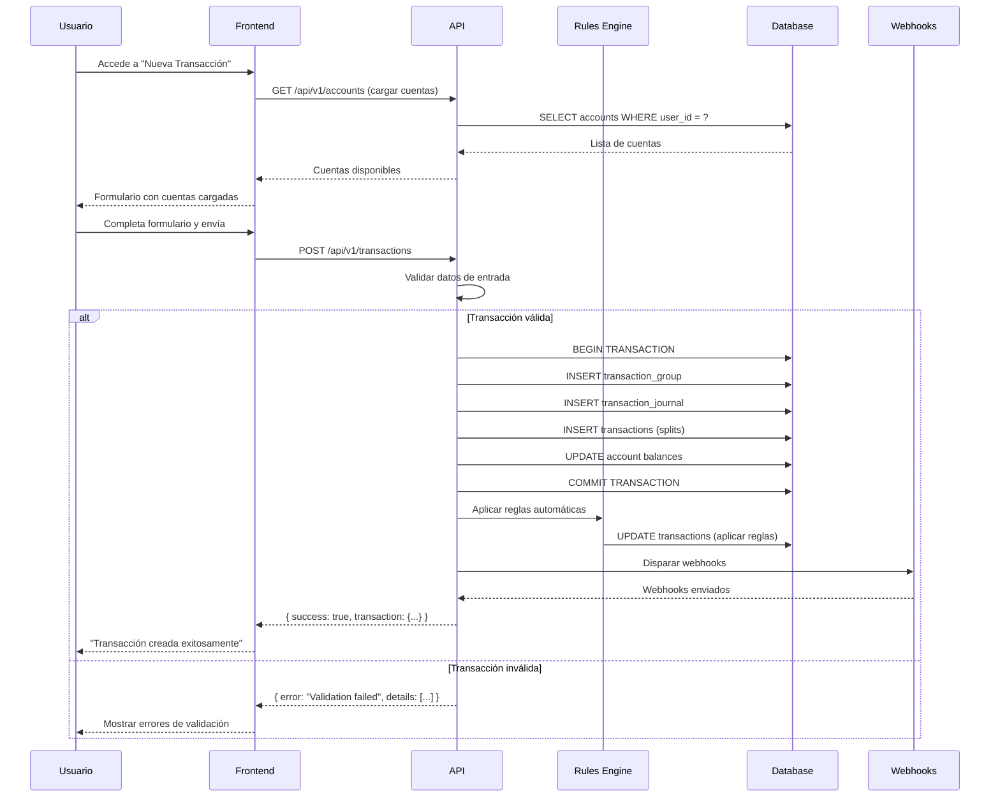
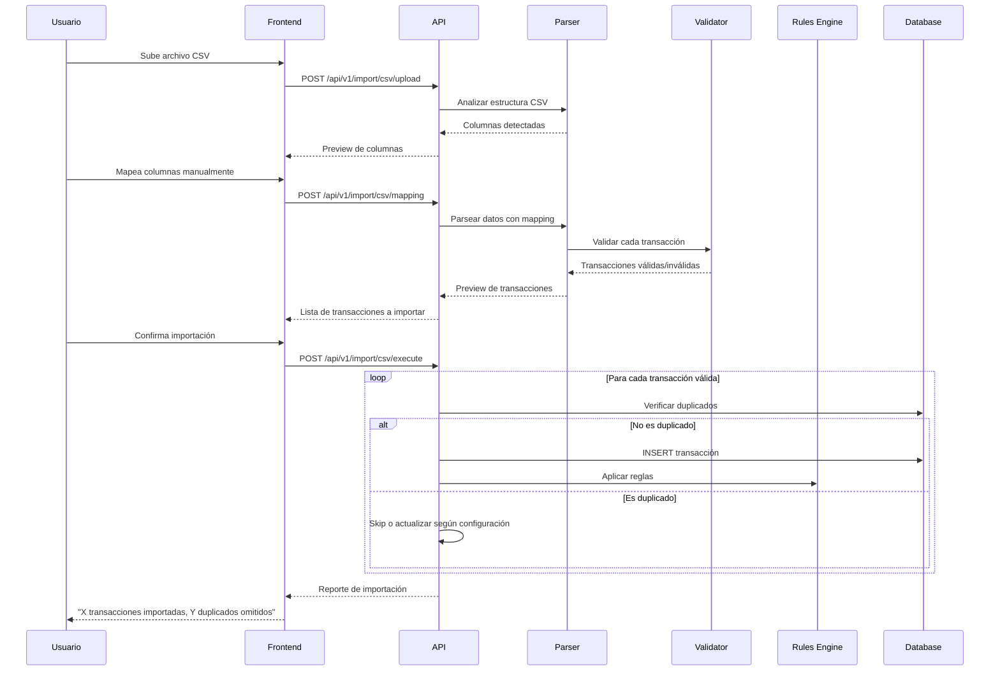
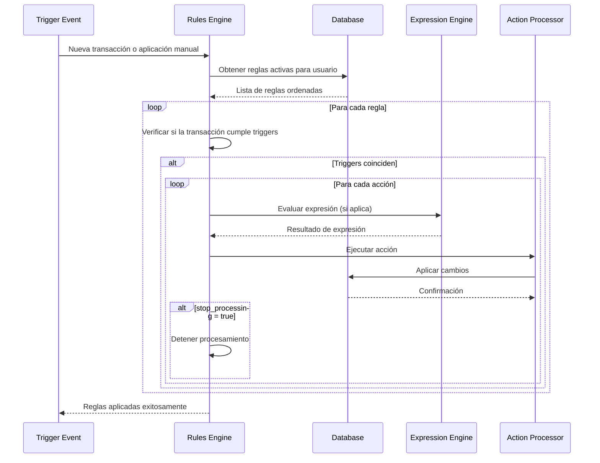
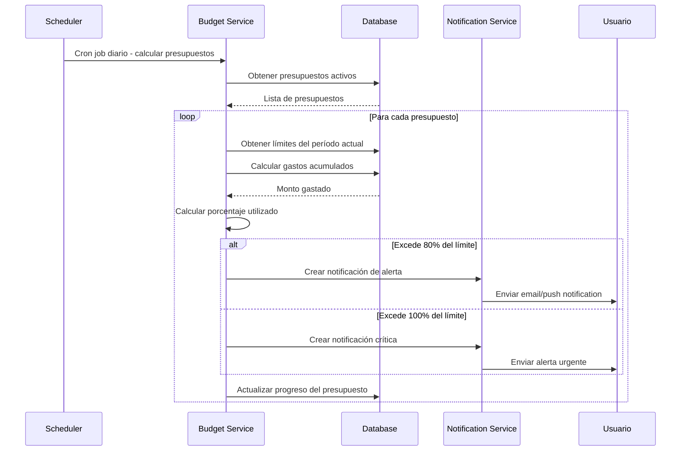

# Especificaciones Técnicas Detalladas - Firefly III Clone

## Flujos de Trabajo Detallados

### 1. Flujo Completo de Registro de Transacción



### 2. Flujo de Importación CSV



### 3. Flujo de Aplicación de Reglas



### 4. Flujo de Cálculo de Presupuesto



## Especificaciones de Base de Datos

### Índices Críticos para Performance

```sql
-- Índices para transacciones (tabla más consultada)
CREATE INDEX CONCURRENTLY idx_transactions_user_date 
ON transactions ((
    SELECT user_id FROM transaction_groups tg 
    JOIN transaction_journals tj ON tg.id = tj.transaction_group_id 
    WHERE tj.id = journal_id
), (
    SELECT date FROM transaction_journals 
    WHERE id = journal_id
));

CREATE INDEX CONCURRENTLY idx_transactions_source_account 
ON transactions(source_account_id) 
WHERE source_account_id IS NOT NULL;

CREATE INDEX CONCURRENTLY idx_transactions_destination_account 
ON transactions(destination_account_id) 
WHERE destination_account_id IS NOT NULL;

CREATE INDEX CONCURRENTLY idx_transactions_amount 
ON transactions(amount) 
WHERE amount IS NOT NULL;

-- Índice para búsquedas de texto en descripciones
CREATE INDEX CONCURRENTLY idx_transaction_journals_description_gin 
ON transaction_journals 
USING gin(to_tsvector('english', description));

-- Índices para cuentas
CREATE INDEX CONCURRENTLY idx_accounts_user_active 
ON accounts(user_id, active) 
WHERE active = true;

CREATE INDEX CONCURRENTLY idx_accounts_type 
ON accounts(account_type_id, user_id);

-- Índices para categorías
CREATE INDEX CONCURRENTLY idx_categories_user_parent 
ON categories(user_id, parent_id);

CREATE INDEX CONCURRENTLY idx_categories_hierarchy 
ON categories(parent_id) 
WHERE parent_id IS NOT NULL;

-- Índices para reglas
CREATE INDEX CONCURRENTLY idx_rules_active_order 
ON rules(active, order_column) 
WHERE active = true;

CREATE INDEX CONCURRENTLY idx_rule_triggers_type 
ON rule_triggers(trigger_type, active) 
WHERE active = true;

-- Índices para presupuestos
CREATE INDEX CONCURRENTLY idx_budget_limits_period 
ON budget_limits(start_date, end_date, budget_id);

-- Índices para etiquetas
CREATE INDEX CONCURRENTLY idx_transaction_tags_transaction 
ON transaction_tags(transaction_id);

CREATE INDEX CONCURRENTLY idx_transaction_tags_tag 
ON transaction_tags(tag_id);
```

### Triggers para Cálculos Automáticos

```sql
-- Trigger para actualizar balances de cuenta automáticamente
CREATE OR REPLACE FUNCTION update_account_balance()
RETURNS TRIGGER AS $$
BEGIN
    -- Actualizar balance de cuenta origen
    IF NEW.source_account_id IS NOT NULL THEN
        UPDATE accounts 
        SET virtual_balance = (
            SELECT COALESCE(SUM(
                CASE 
                    WHEN destination_account_id = accounts.id THEN amount
                    WHEN source_account_id = accounts.id THEN -amount
                    ELSE 0
                END
            ), 0)
            FROM transactions t
            JOIN transaction_journals tj ON t.journal_id = tj.id
            WHERE t.source_account_id = accounts.id 
               OR t.destination_account_id = accounts.id
        )
        WHERE id = NEW.source_account_id;
    END IF;

    -- Actualizar balance de cuenta destino
    IF NEW.destination_account_id IS NOT NULL THEN
        UPDATE accounts 
        SET virtual_balance = (
            SELECT COALESCE(SUM(
                CASE 
                    WHEN destination_account_id = accounts.id THEN amount
                    WHEN source_account_id = accounts.id THEN -amount
                    ELSE 0
                END
            ), 0)
            FROM transactions t
            JOIN transaction_journals tj ON t.journal_id = tj.id
            WHERE t.source_account_id = accounts.id 
               OR t.destination_account_id = accounts.id
        )
        WHERE id = NEW.destination_account_id;
    END IF;

    RETURN NEW;
END;
$$ LANGUAGE plpgsql;

CREATE TRIGGER trigger_update_account_balance
    AFTER INSERT OR UPDATE OR DELETE ON transactions
    FOR EACH ROW EXECUTE FUNCTION update_account_balance();

-- Trigger para generar hash único de transacción
CREATE OR REPLACE FUNCTION generate_transaction_hash()
RETURNS TRIGGER AS $$
BEGIN
    NEW.tag = encode(
        digest(
            CONCAT(
                NEW.description,
                NEW.date::text,
                NEW.transaction_group_id::text,
                extract(epoch from NOW())::text
            ), 
            'sha256'
        ), 
        'hex'
    );
    RETURN NEW;
END;
$$ LANGUAGE plpgsql;

CREATE TRIGGER trigger_generate_transaction_hash
    BEFORE INSERT ON transaction_journals
    FOR EACH ROW EXECUTE FUNCTION generate_transaction_hash();
```

### Vistas para Consultas Complejas

```sql
-- Vista para transacciones con información completa
CREATE VIEW v_transactions_complete AS
SELECT 
    t.id,
    t.amount,
    t.description as transaction_description,
    tj.description as journal_description,
    tj.date,
    tj.tag,
    sa.name as source_account_name,
    sa.account_type_id as source_account_type,
    da.name as destination_account_name,
    da.account_type_id as destination_account_type,
    c.name as category_name,
    c.parent_id as category_parent_id,
    cur.code as currency_code,
    cur.symbol as currency_symbol,
    tg.user_id,
    tg.title as group_title,
    ARRAY_AGG(tag.tag) as tags
FROM transactions t
JOIN transaction_journals tj ON t.journal_id = tj.id
JOIN transaction_groups tg ON tj.transaction_group_id = tg.id
JOIN accounts sa ON t.source_account_id = sa.id
JOIN accounts da ON t.destination_account_id = da.id
LEFT JOIN categories c ON t.category_id = c.id
LEFT JOIN currencies cur ON t.currency_id = cur.id
LEFT JOIN transaction_tags tt ON t.id = tt.transaction_id
LEFT JOIN tags tag ON tt.tag_id = tag.id
GROUP BY t.id, tj.id, tg.id, sa.id, da.id, c.id, cur.id;

-- Vista para balances de cuentas por período
CREATE VIEW v_account_balances_by_period AS
WITH daily_balances AS (
    SELECT 
        a.id as account_id,
        a.user_id,
        a.name as account_name,
        generate_series(
            date_trunc('month', CURRENT_DATE - INTERVAL '12 months'),
            CURRENT_DATE,
            INTERVAL '1 day'
        )::date as balance_date
    FROM accounts a
    WHERE a.active = true
),
transactions_by_date AS (
    SELECT 
        CASE 
            WHEN t.source_account_id = a.id THEN t.source_account_id
            WHEN t.destination_account_id = a.id THEN t.destination_account_id
        END as account_id,
        tj.date,
        SUM(CASE 
            WHEN t.destination_account_id = a.id THEN t.amount
            WHEN t.source_account_id = a.id THEN -t.amount
            ELSE 0
        END) as daily_change
    FROM transactions t
    JOIN transaction_journals tj ON t.journal_id = tj.id
    JOIN accounts a ON (t.source_account_id = a.id OR t.destination_account_id = a.id)
    GROUP BY account_id, tj.date
)
SELECT 
    db.account_id,
    db.user_id,
    db.account_name,
    db.balance_date,
    COALESCE(
        SUM(tbd.daily_change) OVER (
            PARTITION BY db.account_id 
            ORDER BY db.balance_date 
            ROWS UNBOUNDED PRECEDING
        ), 
        0
    ) as running_balance
FROM daily_balances db
LEFT JOIN transactions_by_date tbd ON db.account_id = tbd.account_id 
    AND db.balance_date = tbd.date;

-- Vista para estadísticas de presupuesto
CREATE VIEW v_budget_statistics AS
SELECT 
    b.id as budget_id,
    b.user_id,
    b.name as budget_name,
    bl.start_date,
    bl.end_date,
    bl.amount as budget_limit,
    bl.period,
    COALESCE(SUM(t.amount), 0) as amount_spent,
    bl.amount - COALESCE(SUM(t.amount), 0) as amount_remaining,
    CASE 
        WHEN bl.amount > 0 THEN 
            (COALESCE(SUM(t.amount), 0) / bl.amount) * 100
        ELSE 0 
    END as percentage_used
FROM budgets b
JOIN budget_limits bl ON b.id = bl.budget_id
LEFT JOIN budget_transactions bt ON b.id = bt.budget_id
LEFT JOIN transactions t ON bt.transaction_id = t.id
LEFT JOIN transaction_journals tj ON t.journal_id = tj.id
WHERE bl.start_date <= CURRENT_DATE 
    AND bl.end_date >= CURRENT_DATE
    AND tj.date BETWEEN bl.start_date AND bl.end_date
GROUP BY b.id, bl.id;
```

## Especificaciones de API

### Esquemas de Validación

```typescript
// DTOs para validación de entrada
export class CreateTransactionDto {
  @IsString()
  @IsNotEmpty()
  description: string;

  @IsDateString()
  date: string;

  @IsArray()
  @ValidateNested({ each: true })
  @Type(() => TransactionSplitDto)
  @ArrayMinSize(1)
  transactions: TransactionSplitDto[];

  @IsOptional()
  @IsString()
  notes?: string;

  @IsOptional()
  @IsArray()
  @IsString({ each: true })
  tags?: string[];
}

export class TransactionSplitDto {
  @IsNumber()
  @IsPositive()
  source_account_id: number;

  @IsNumber()
  @IsPositive()
  destination_account_id: number;

  @IsNumber()
  @IsPositive()
  @Transform(({ value }) => parseFloat(value))
  amount: number;

  @IsOptional()
  @IsString()
  description?: string;

  @IsOptional()
  @IsNumber()
  @IsPositive()
  category_id?: number;

  @IsOptional()
  @IsNumber()
  @IsPositive()
  budget_id?: number;

  @IsOptional()
  @IsNumber()
  @IsPositive()
  currency_id?: number;

  @IsOptional()
  @IsNumber()
  @IsPositive()
  foreign_currency_id?: number;

  @IsOptional()
  @IsNumber()
  @IsPositive()
  foreign_amount?: number;
}

export class CreateRuleDto {
  @IsString()
  @IsNotEmpty()
  title: string;

  @IsOptional()
  @IsString()
  description?: string;

  @IsNumber()
  @IsPositive()
  rule_group_id: number;

  @IsOptional()
  @IsBoolean()
  active?: boolean = true;

  @IsOptional()
  @IsBoolean()
  strict?: boolean = true;

  @IsOptional()
  @IsBoolean()
  stop_processing?: boolean = false;

  @IsArray()
  @ValidateNested({ each: true })
  @Type(() => RuleTriggerDto)
  @ArrayMinSize(1)
  triggers: RuleTriggerDto[];

  @IsArray()
  @ValidateNested({ each: true })
  @Type(() => RuleActionDto)
  @ArrayMinSize(1)
  actions: RuleActionDto[];
}

export class RuleTriggerDto {
  @IsString()
  @IsIn([
    'description_contains', 'description_starts', 'description_ends',
    'amount_exactly', 'amount_more', 'amount_less',
    'source_account_is', 'destination_account_is',
    'category_is', 'budget_is', 'tag_is',
    'has_attachments', 'notes_contain'
  ])
  trigger_type: string;

  @IsString()
  @IsNotEmpty()
  trigger_value: string;

  @IsOptional()
  @IsBoolean()
  active?: boolean = true;

  @IsOptional()
  @IsBoolean()
  stop_processing?: boolean = false;
}

export class RuleActionDto {
  @IsString()
  @IsIn([
    'set_category', 'clear_category',
    'set_budget', 'clear_budget',
    'add_tag', 'remove_tag', 'remove_all_tags',
    'set_description', 'append_description', 'prepend_description',
    'set_notes', 'append_notes', 'prepend_notes',
    'set_source_account', 'set_destination_account'
  ])
  action_type: string;

  @IsString()
  action_value: string;

  @IsOptional()
  @IsBoolean()
  active?: boolean = true;

  @IsOptional()
  @IsBoolean()
  stop_processing?: boolean = false;
}
```

### Middlewares de Seguridad

```typescript
// Rate limiting middleware
@Injectable()
export class RateLimitMiddleware implements NestMiddleware {
  private readonly limiter = rateLimit({
    windowMs: 15 * 60 * 1000, // 15 minutos
    max: (req) => {
      // Diferentes límites según el endpoint
      if (req.path.includes('/import/')) {
        return 5; // 5 importaciones por 15 min
      }
      if (req.path.includes('/export/')) {
        return 10; // 10 exportaciones por 15 min
      }
      if (req.path.includes('/reports/')) {
        return 30; // 30 reportes por 15 min
      }
      return 100; // 100 requests generales por 15 min
    },
    message: 'Too many requests from this IP',
    standardHeaders: true,
    legacyHeaders: false,
  });

  use(req: Request, res: Response, next: NextFunction) {
    this.limiter(req, res, next);
  }
}

// Audit logging middleware
@Injectable()
export class AuditMiddleware implements NestMiddleware {
  constructor(
    private readonly auditService: AuditService,
    private readonly logger: Logger
  ) {}

  use(req: Request, res: Response, next: NextFunction) {
    const startTime = Date.now();
    const { method, originalUrl, ip } = req;
    const userId = req.user?.id;

    res.on('finish', () => {
      const { statusCode } = res;
      const duration = Date.now() - startTime;

      // Log para auditoría
      if (this.shouldAudit(method, originalUrl)) {
        this.auditService.log({
          userId,
          method,
          url: originalUrl,
          statusCode,
          duration,
          ip,
          userAgent: req.get('User-Agent'),
          timestamp: new Date(),
        });
      }

      // Log para monitoring
      this.logger.log(
        `${method} ${originalUrl} ${statusCode} ${duration}ms`,
        'HTTP'
      );
    });

    next();
  }

  private shouldAudit(method: string, url: string): boolean {
    // Auditar operaciones de escritura y endpoints sensibles
    const writeOperations = ['POST', 'PUT', 'PATCH', 'DELETE'];
    const sensitiveEndpoints = ['/auth/', '/admin/', '/users/'];
    
    return writeOperations.includes(method) || 
           sensitiveEndpoints.some(endpoint => url.includes(endpoint));
  }
}
```

### Interceptores para Response Transformation

```typescript
@Injectable()
export class TransformInterceptor<T> implements NestInterceptor<T, any> {
  intercept(context: ExecutionContext, next: CallHandler): Observable<any> {
    const request = context.switchToHttp().getRequest();
    const isApiV2 = request.url.includes('/api/v2/');

    return next.handle().pipe(
      map(data => {
        if (isApiV2) {
          // Formato JSON:API para v2
          return this.transformToJsonApi(data, request);
        } else {
          // Formato simple para v1
          return {
            success: true,
            data,
            timestamp: new Date().toISOString(),
            path: request.url,
          };
        }
      }),
      catchError(error => {
        throw new HttpException(
          {
            success: false,
            error: error.message,
            timestamp: new Date().toISOString(),
            path: request.url,
          },
          error.status || HttpStatus.INTERNAL_SERVER_ERROR,
        );
      }),
    );
  }

  private transformToJsonApi(data: any, request: any) {
    if (Array.isArray(data)) {
      return {
        data: data.map(item => ({
          type: this.getResourceType(request.url),
          id: item.id?.toString(),
          attributes: { ...item, id: undefined },
        })),
        meta: {
          timestamp: new Date().toISOString(),
          path: request.url,
        },
      };
    } else {
      return {
        data: {
          type: this.getResourceType(request.url),
          id: data.id?.toString(),
          attributes: { ...data, id: undefined },
        },
        meta: {
          timestamp: new Date().toISOString(),
          path: request.url,
        },
      };
    }
  }

  private getResourceType(url: string): string {
    const segments = url.split('/').filter(Boolean);
    return segments[segments.length - 1] || 'unknown';
  }
}
```

## Configuración de Testing

### Testing Strategy

```typescript
// Test de integración para transacciones
describe('TransactionsController (e2e)', () => {
  let app: INestApplication;
  let userToken: string;
  let testUser: User;
  let testAccount: Account;

  beforeAll(async () => {
    const moduleFixture: TestingModule = await Test.createTestingModule({
      imports: [AppModule],
    }).compile();

    app = moduleFixture.createNestApplication();
    await app.init();

    // Setup test user y account
    const { user, token } = await createTestUser(app);
    testUser = user;
    userToken = token;
    testAccount = await createTestAccount(app, user.id);
  });

  describe('POST /transactions', () => {
    it('should create a simple transaction', async () => {
      const transactionData = {
        description: 'Test transaction',
        date: '2024-01-15',
        transactions: [
          {
            source_account_id: testAccount.id,
            destination_account_id: 2, // expense account
            amount: 50.00,
            description: 'Test expense',
          },
        ],
      };

      const response = await request(app.getHttpServer())
        .post('/api/v1/transactions')
        .set('Authorization', `Bearer ${userToken}`)
        .send(transactionData)
        .expect(201);

      expect(response.body.data).toMatchObject({
        description: 'Test transaction',
        transactions: expect.arrayContaining([
          expect.objectContaining({
            amount: 50.00,
            source_account_id: testAccount.id,
            destination_account_id: 2,
          }),
        ]),
      });

      // Verificar que el balance se actualizó
      const updatedAccount = await getAccount(app, testAccount.id);
      expect(updatedAccount.virtual_balance).toBe(
        testAccount.virtual_balance - 50.00
      );
    });

    it('should apply rules automatically', async () => {
      // Crear regla de test
      await createTestRule(app, testUser.id, {
        triggers: [{ type: 'description_contains', value: 'AMAZON' }],
        actions: [{ type: 'set_category', value: 'Online Shopping' }],
      });

      const transactionData = {
        description: 'AMAZON.COM purchase',
        date: '2024-01-15',
        transactions: [
          {
            source_account_id: testAccount.id,
            destination_account_id: 2,
            amount: 25.99,
          },
        ],
      };

      const response = await request(app.getHttpServer())
        .post('/api/v1/transactions')
        .set('Authorization', `Bearer ${userToken}`)
        .send(transactionData)
        .expect(201);

      // Verificar que la regla se aplicó
      expect(response.body.data.transactions[0]).toMatchObject({
        category: expect.objectContaining({
          name: 'Online Shopping',
        }),
      });
    });
  });

  describe('GET /transactions', () => {
    it('should return paginated transactions', async () => {
      const response = await request(app.getHttpServer())
        .get('/api/v1/transactions?page=1&limit=10')
        .set('Authorization', `Bearer ${userToken}`)
        .expect(200);

      expect(response.body.data).toEqual(
        expect.arrayContaining([
          expect.objectContaining({
            id: expect.any(Number),
            description: expect.any(String),
            date: expect.any(String),
            transactions: expect.any(Array),
          }),
        ])
      );

      expect(response.body.meta).toMatchObject({
        page: 1,
        limit: 10,
        total: expect.any(Number),
        pages: expect.any(Number),
      });
    });

    it('should filter transactions by date range', async () => {
      const response = await request(app.getHttpServer())
        .get('/api/v1/transactions?start=2024-01-01&end=2024-01-31')
        .set('Authorization', `Bearer ${userToken}`)
        .expect(200);

      response.body.data.forEach(transaction => {
        expect(new Date(transaction.date)).toBeGreaterThanOrEqual(
          new Date('2024-01-01')
        );
        expect(new Date(transaction.date)).toBeLessThanOrEqual(
          new Date('2024-01-31')
        );
      });
    });
  });
});

// Test unitario para Rules Engine
describe('RulesEngine', () => {
  let rulesEngine: RulesEngine;
  let mockRepository: jest.Mocked<Repository<Rule>>;

  beforeEach(async () => {
    const module: TestingModule = await Test.createTestingModule({
      providers: [
        RulesEngine,
        {
          provide: getRepositoryToken(Rule),
          useValue: {
            find: jest.fn(),
            save: jest.fn(),
          },
        },
      ],
    }).compile();

    rulesEngine = module.get<RulesEngine>(RulesEngine);
    mockRepository = module.get(getRepositoryToken(Rule));
  });

  describe('applyRules', () => {
    it('should apply matching rules to transaction', async () => {
      const mockRule = {
        id: 1,
        title: 'Amazon Rule',
        active: true,
        triggers: [
          {
            trigger_type: 'description_contains',
            trigger_value: 'AMAZON',
            active: true,
          },
        ],
        actions: [
          {
            action_type: 'set_category',
            action_value: 'Online Shopping',
            active: true,
          },
        ],
      };

      const mockTransaction = {
        id: 1,
        description: 'AMAZON.COM - Order #123',
        amount: 29.99,
        source_account_id: 1,
        destination_account_id: 2,
      };

      mockRepository.find.mockResolvedValue([mockRule]);

      const result = await rulesEngine.applyRules(
        mockTransaction,
        1 // user_id
      );

      expect(result.modified).toBe(true);
      expect(result.appliedRules).toHaveLength(1);
      expect(result.appliedRules[0]).toBe('Amazon Rule');
    });

    it('should not apply rules when triggers do not match', async () => {
      const mockRule = {
        id: 1,
        title: 'Amazon Rule',
        active: true,
        triggers: [
          {
            trigger_type: 'description_contains',
            trigger_value: 'AMAZON',
            active: true,
          },
        ],
        actions: [
          {
            action_type: 'set_category',
            action_value: 'Online Shopping',
            active: true,
          },
        ],
      };

      const mockTransaction = {
        id: 1,
        description: 'Local grocery store',
        amount: 45.67,
        source_account_id: 1,
        destination_account_id: 2,
      };

      mockRepository.find.mockResolvedValue([mockRule]);

      const result = await rulesEngine.applyRules(
        mockTransaction,
        1 // user_id
      );

      expect(result.modified).toBe(false);
      expect(result.appliedRules).toHaveLength(0);
    });
  });
});
```

## Performance Optimization

### Caching Strategy

```typescript
// Cache configuration
@Injectable()
export class CacheService {
  constructor(@Inject(CACHE_MANAGER) private cacheManager: Cache) {}

  // Cache de balances de cuentas (5 minutos)
  async getAccountBalance(accountId: number): Promise<number> {
    const cacheKey = `account_balance_${accountId}`;
    const cached = await this.cacheManager.get<number>(cacheKey);
    
    if (cached !== undefined) {
      return cached;
    }

    const balance = await this.calculateAccountBalance(accountId);
    await this.cacheManager.set(cacheKey, balance, 300); // 5 min TTL
    return balance;
  }

  // Cache de reportes (30 minutos)
  async getCachedReport(
    reportType: string,
    userId: number,
    params: any
  ): Promise<any> {
    const cacheKey = `report_${reportType}_${userId}_${JSON.stringify(params)}`;
    const cached = await this.cacheManager.get(cacheKey);
    
    if (cached) {
      return cached;
    }

    const report = await this.generateReport(reportType, userId, params);
    await this.cacheManager.set(cacheKey, report, 1800); // 30 min TTL
    return report;
  }

  // Invalidar cache cuando se modifica una transacción
  async invalidateAccountCache(accountId: number): Promise<void> {
    const pattern = `account_balance_${accountId}`;
    await this.cacheManager.del(pattern);
  }

  // Invalidar cache de reportes cuando hay cambios
  async invalidateUserReports(userId: number): Promise<void> {
    const pattern = `report_*_${userId}_*`;
    // En Redis: KEYS pattern, luego DEL
    // Aquí simplificaremos
    await this.cacheManager.reset();
  }
}

// Database query optimization
@Injectable()
export class TransactionService {
  constructor(
    @InjectRepository(Transaction)
    private transactionRepository: Repository<Transaction>,
  ) {}

  // Consulta optimizada para lista de transacciones
  async findTransactionsOptimized(
    userId: number,
    filters: TransactionFilters,
    pagination: PaginationOptions,
  ): Promise<PaginatedResult<Transaction>> {
    const queryBuilder = this.transactionRepository
      .createQueryBuilder('t')
      .leftJoinAndSelect('t.journal', 'tj')
      .leftJoinAndSelect('tj.group', 'tg')
      .leftJoinAndSelect('t.sourceAccount', 'sa')
      .leftJoinAndSelect('t.destinationAccount', 'da')
      .leftJoinAndSelect('t.category', 'c')
      .leftJoinAndSelect('t.currency', 'cur')
      .leftJoinAndSelect('t.tags', 'tags')
      .where('tg.user_id = :userId', { userId })
      .orderBy('tj.date', 'DESC')
      .addOrderBy('t.id', 'DESC');

    // Aplicar filtros de manera eficiente
    if (filters.start_date) {
      queryBuilder.andWhere('tj.date >= :startDate', {
        startDate: filters.start_date,
      });
    }

    if (filters.end_date) {
      queryBuilder.andWhere('tj.date <= :endDate', {
        endDate: filters.end_date,
      });
    }

    if (filters.account_ids?.length > 0) {
      queryBuilder.andWhere(
        '(t.source_account_id IN (:...accountIds) OR t.destination_account_id IN (:...accountIds))',
        { accountIds: filters.account_ids },
      );
    }

    if (filters.category_ids?.length > 0) {
      queryBuilder.andWhere('t.category_id IN (:...categoryIds)', {
        categoryIds: filters.category_ids,
      });
    }

    if (filters.amount_min !== undefined) {
      queryBuilder.andWhere('t.amount >= :amountMin', {
        amountMin: filters.amount_min,
      });
    }

    if (filters.amount_max !== undefined) {
      queryBuilder.andWhere('t.amount <= :amountMax', {
        amountMax: filters.amount_max,
      });
    }

    if (filters.description) {
      queryBuilder.andWhere(
        '(tj.description ILIKE :description OR t.description ILIKE :description)',
        { description: `%${filters.description}%` },
      );
    }

    // Aplicar paginación
    const skip = (pagination.page - 1) * pagination.limit;
    queryBuilder.skip(skip).take(pagination.limit);

    // Ejecutar consulta optimizada
    const [transactions, total] = await queryBuilder.getManyAndCount();

    return {
      data: transactions,
      meta: {
        page: pagination.page,
        limit: pagination.limit,
        total,
        pages: Math.ceil(total / pagination.limit),
      },
    };
  }

  // Bulk operations para mejor performance
  async bulkUpdateTransactions(
    transactionIds: number[],
    updates: Partial<Transaction>,
    userId: number,
  ): Promise<void> {
    await this.transactionRepository
      .createQueryBuilder()
      .update(Transaction)
      .set(updates)
      .where('id IN (:...ids)', { ids: transactionIds })
      .andWhere(
        'journal_id IN (SELECT tj.id FROM transaction_journals tj JOIN transaction_groups tg ON tj.transaction_group_id = tg.id WHERE tg.user_id = :userId)',
        { userId },
      )
      .execute();
  }
}
```

Este documento complementa el análisis principal con especificaciones técnicas detalladas, flujos de trabajo, optimizaciones de base de datos y estrategias de testing y performance que serán fundamentales para la implementación exitosa del proyecto.